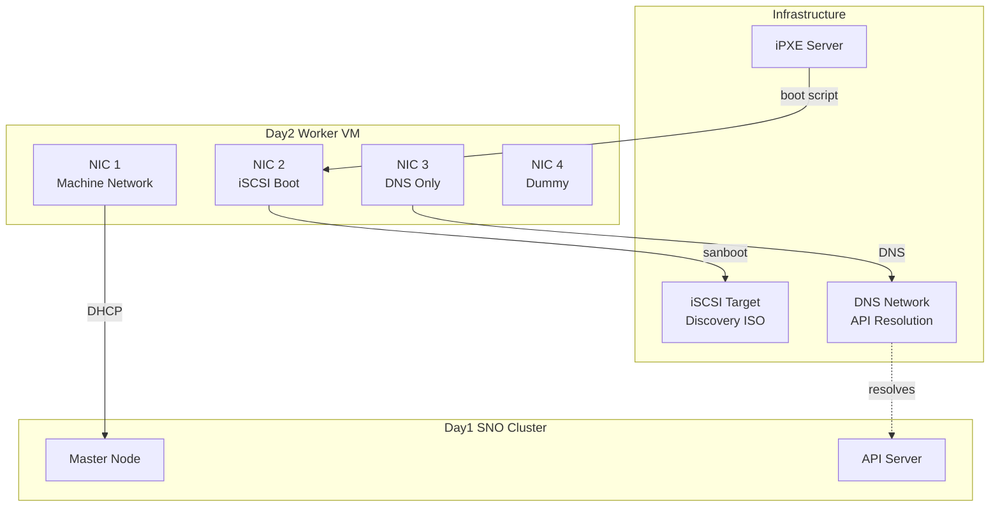
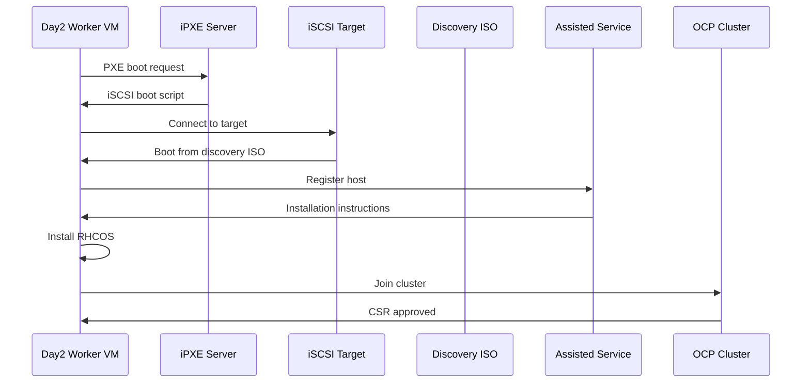
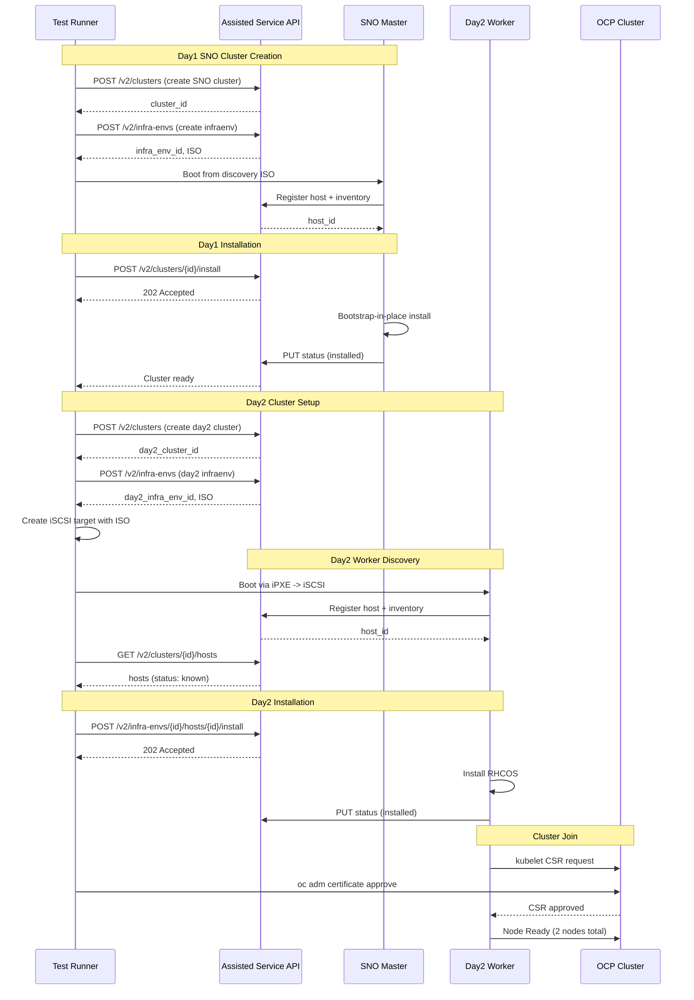

# Day2 iSCSI Multi-NIC Test

Test for adding a day2 worker to a SNO cluster with iSCSI boot and multiple network interfaces.

## Architecture



## Boot Sequence



## API Sequence



## Test Class

`TestDay2Iscsi` in `src/tests/test_day2_iscsi.py`

Extends `BaseTest` and uses existing fixtures: `iscsi_target_controller`, `ipxe_server`, `attach_interface`, `cluster`, `day2_cluster`.

## Fixtures

| Fixture | Purpose |
|---------|---------|
| `sno_cluster_configuration` | Day1 as SNO (1 master, 0 workers, HA mode: none) |
| `sno_controller_configuration` | Bootstrap-in-place enabled for SNO |
| `iscsi_day2_controller_configuration` | Boot order: `["network", "hd"]` |
| `iscsi_day2_cluster_configuration` | 1 day2 worker, 0 day2 masters |

## Network Templates

| Network | CIDR | DHCP | Purpose |
|---------|------|------|---------|
| iSCSI | `192.168.200.0/24` | Yes | iSCSI boot network with NAT |
| DNS | `192.168.201.0/24` | Yes | DNS entries for day1 API resolution |
| Dummy | N/A | No | Isolated, no IP configuration |
| Machine | (day1 network) | Yes | Already configured by Terraform |

## Test Flow

1. Day1 SNO cluster installed (via `cluster` fixture)
2. Generate day2 discovery ISO
3. Create iSCSI target with discovery ISO
4. Set up iPXE server with custom iSCSI boot script
5. Create day2 worker VMs (stopped)
6. Attach 3 additional NICs (iSCSI, DNS, dummy)
7. Start worker - boots via iPXE -> iSCSI -> discovery ISO
8. Wait for discovery and registration
9. Install day2 worker
10. Verify worker joined the OCP cluster

## iPXE Boot Script

```ipxe
#!ipxe
dhcp net0
set initiator-iqn {initiator_iqn}
sanboot iscsi:{server_ip}::::{target_iqn}
```

## Running the Test

```bash
export OPENSHIFT_VERSION=4.20
export NUM_MASTERS=1
export NUM_WORKERS=0
export NUM_DAY2_WORKERS=1
export TEST_TEARDOWN=false  # Optional: keep resources for debugging
make test TEST=./src/tests/test_day2_iscsi.py TEST_FUNC=test_day2_iscsi_multi_nic
```

## Verification

After the test runs, verify:

```bash
# Check VMs
virsh list --all  # Should show SNO master + day2 worker

# Check networks
virsh net-list  # Should show 4+ networks

# Check iSCSI target
targetcli ls  # Should show configured target

# Check cluster nodes
oc get nodes  # Should show 2 nodes (1 master + 1 worker)
```

## Accessing Logs

The test includes 27 `log.info()` statements for debugging. Access logs in these locations:

**Console output (real-time)**
```bash
# Logs appear directly in terminal when running
make test TEST=./src/tests/test_day2_iscsi.py TEST_FUNC=test_day2_iscsi_multi_nic
```

**Reports directory**
```bash
# Test reports and logs stored in:
./reports/

# View the latest test log
ls -la ./reports/
```

**Download cluster logs (on failure)**
```bash
make download_logs          # Assisted-service logs
make download_cluster_logs  # Cluster-specific logs
```

**Service logs (kind/minikube)**
```bash
kubectl logs -n assisted-installer deployment/assisted-service
```

**Virsh/libvirt logs (VM console)**
```bash
virsh console <vm-name>     # VM console output
journalctl -u libvirtd      # Libvirt logs
```

## Dependencies

- `targetcli` installed on hypervisor for iSCSI target management
- iPXE-enabled network boot support in libvirt
- Pull secret configured (`PULL_SECRET` or `PULL_SECRET_FILE`)
